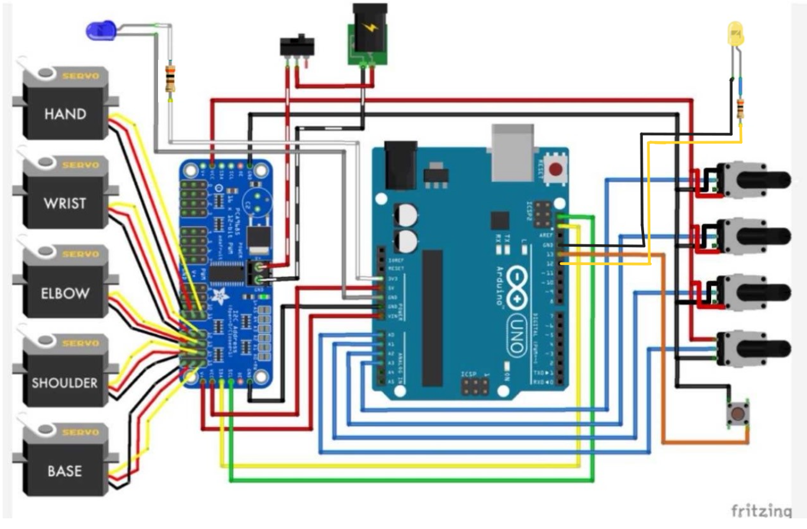

# Arduino controlled robotarm

Can be controlled with an android app or a small replica of the robot.

Design by Kelton (BuildSomeStuff), STL Files and basic Arduino code:

https://www.thingiverse.com/thing:6313449

## Files

RobotControl.aia is the projekt for the MIT AppInventor

RobotControl.apk is the build android app. It was tested on Android 11, 13 and 14. Unfortunatly it wont run on android 13 (Xiaomi 12T Pro).

RobotControl.ino is the arduino code including the original potentiometer control and the Bluetooth Low Energy extension. Through the extension it is possibel to control the robot with an app.

part_list contains the used parts.

doc contains explanations (german).

## Circuit diagram

